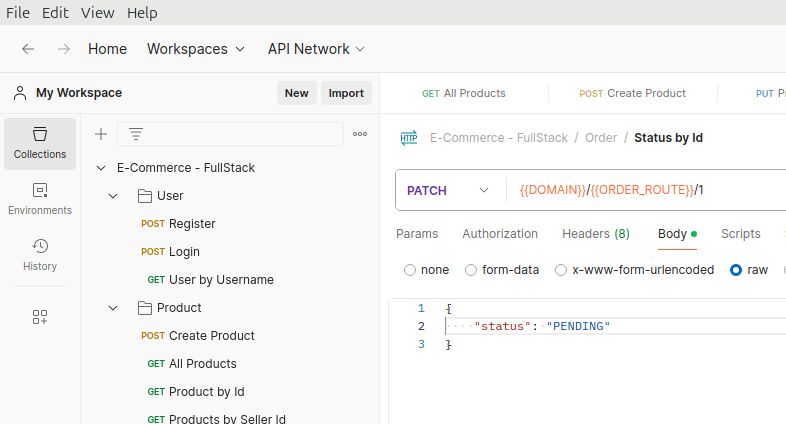

# Backend do E-commerce FullStack

Backend para o funcionamento do site do Ecommerce *FullStack*, usando rotas *HTTP* e as entidades relacionadas as regras de negócio da aplicação, com rotas autorizadas através de **JWT**.

## Sumário

- [Tecnologias Utilizadas](#-tecnologias-usadas)
- [Instalação](#-instalação)
- [Estrutura do Projeto](#-estrutura-do-projeto)

## &#x1F5A5; Tecnologias Usadas

&nbsp;
&nbsp;
&nbsp;
&nbsp;
&nbsp;
&nbsp;

## &#x2699; Instalação

Instruções para configurar o projeto localmente.

### Pré-requisitos

- [Node.js](https://nodejs.org/)
- [NPM](https://www.npmjs.com/) ou [NVM](https://github.com/nvm-sh/nvm)

> &#x26A0; A versão do Node.js que o projeto foi feito foi na versão **v20.15.1**, versões anteriores/posteriores podem não ser compatíveis com o projeto, caso tenha o **NVM** instalado, instale a versão correspondente com os comandos:
```bash
# installs nvm (Node Version Manager)
curl -o- https://raw.githubusercontent.com/nvm-sh/nvm/v0.39.7/install.sh | bash

# download and install Node.js (you may need to restart the terminal)
nvm install 20.15.1

# verifies the right Node.js version is in the environment
node -v # should print `v20.15.1`

# verifies the right npm version is in the environment
npm -v
```

#### OPCIONAL

- Baixe o aplicativo dektop do [Postman](https://www.postman.com/).
    - Baixe o arquivo [JSON das Requisições](./readme/E-Commerce%20-%20FullStack.postman_collection.json)
        1. Em seguida, no canto superior esquerdo no aplicativo do **Postman**, clique no botão "*Import*":
        
        2. Selecione o arquivo **JSON** baixado no [link do JSON acima](#opcional) e importe o arquivo.

### Passos

1. Clone o repositório:
```sh
git clone https://github.com/gustavo-martins-pereira/E-commerce_FullStack-Backend.git
```

2. Navegue até o diretório do projeto:
```sh
cd nome-do-repositorio
```

3. Instale as dependências:
```sh
npm install
```

4. Configure o arquivo de ambiente `.env` conforme o seu banco PostgreSQL.
> Até o momento o banco usado no projeto é um banco de dados local

<details>
    <summary><b><i>Passos para a configuração inicial do banco</i></b></summary>

    1. Caso esteja usando o psql, para criar o banco de dados digite o comando:
    CREATE DATABASE ecommerce;
    ⚠ Lembre-se que o nome do banco será usado para configurar a conexão com o banco de dados no arquivo .env
</details>

5. Para executar as migrations do projeto, em um terminal na raiz do projeto, digite o comando:
```bash
npx sequelize-cli db:migrate
```

6. Em seguida, execute o projeto com:
```bash
npm run start
```

## &#x1F4C1; Estrutura do Projeto

```
/src
├── /config
├── /controllers
│   ├── entityController.js
├── /db
│   ├── /config
│   ├── /migrations
│   ├── /models
│   ├── /seeders
│   └── package.json
├── /middlewares
├── /repositories
│   ├── entityRepository.js
├── /routes
│   ├── /validators
│   └── routes.js
├── /services
│   ├── /entity
├── /utils
│   ├── /errors
│   └── encryption.js
└── server.js
.env
.env.example
.gitignore
.sequelizerc
LICENSE
package-lock.json
package.json
readme.md
```
